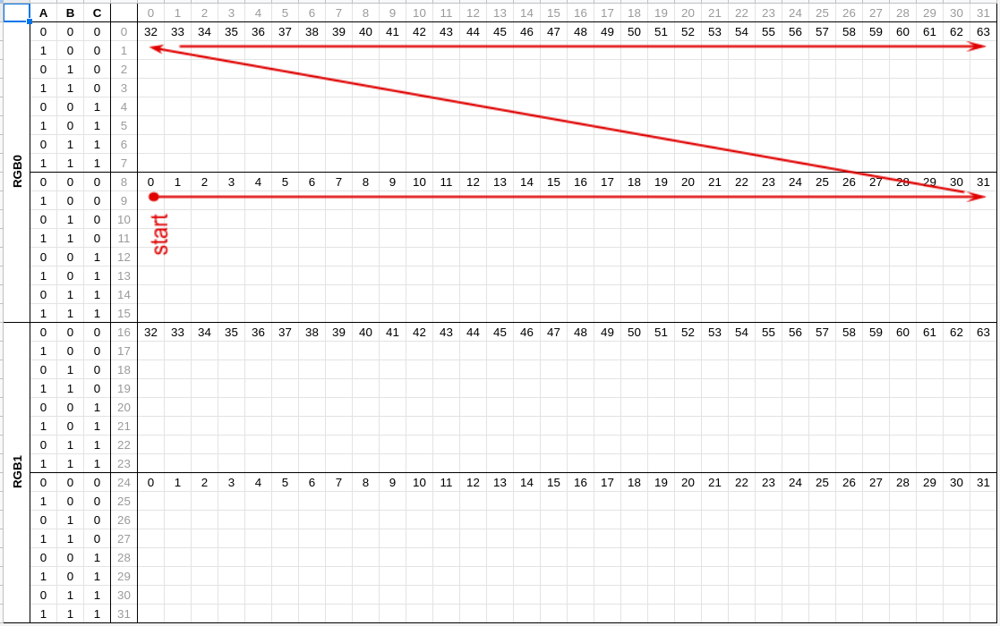

# P5-32X32-8S-75-13A

# Передача данных

- Скан матрицы 8, это означает, что одновременно горит 128 светодиодов (32*32/8), т.е. 4 строки
- Матрица разбита на 2 блока RGB0/RGB1, каждый по 16 строк, 512 светодиодов
- Но адресация строк 3'х битная A B C, т.е в каждом блоке можно адресовать только 8 строк
- Потому данные передаются "змейкой", причем сперва на нижнюю четверть блока, затем на верхюю (см рисунок) 

## Общий алгоритм

- Выключаем матрицу устанвливая ОЕ
- Задаем строку ABC
- Передаем по 64 бита в R0 G0 B0 и R1 G1 B1, дергая после каждой установки CLK
- В конце дергаем LATCH
- Вкючаем матрицу сбрасывая OE
- Повторяем все заново перключив строку на следующую.
- Если подключено несколько панелей последовательэо передаём 64*N бит, где N - число панелей в цепочке

[пример для двух панелей](/esp32_barebone.1)

# Чипсет

- [MBI5124GP](https://lcsc.com/product-detail/LED-Drivers_MBI-MBI5124GP-B_C256866.html) Led driver
- [SM245TS](https://lcsc.com/product-detail/74-Series_Shenzhen-Sunmoon-Micro-SM245TS_C93846.html) Tri-state output signal Octal Transceiver
- [SM74HC138D](https://lcsc.com/product-detail/74-Series_Shenzhen-Sunmoon-Micro-SM74HC138_C91436.html) 3-to-8 demultiplexor

# Примеры

Скорости плат ардуино определенно не хватает для отрисовки на подобных панелях, но тем не менее работает.

- [RGBmatrixPanelHalfScan](/RGBmatrixPanelHalfScan) - пример под arduino
- [esp32_barebone.0](/esp32_barebone.0) - пример под esp32 - тест развертки, вывод на 2 панели
- [esp32_barebone.1](/esp32_barebone.1) - пример под esp32 - тест вывода на 2 панели, после мепинга развертки
- [esp32_smartmatrix](/esp_32smartmatrix_0) - тест библиотеки SmartMatrix

# Материалы

- [AdaFruits](https://learn.adafruit.com/32x16-32x32-rgb-led-matrix?view=all)
- https://github.com/VGottselig/ESP32-RGB-Matrix-Display
- https://www.youtube.com/watch?v=xyycbgZXPzE
- https://www.youtube.com/watch?v=nhCGgTd7OHg
- https://hackaday.io/project/26993-bot-matrix/log/69571-enter-the-matrix 
- http://wiki.amperka.ru/projects:rgb-led-matrix-arduino
- https://github.com/Frans-Willem/LEDMatrixHUB75 
