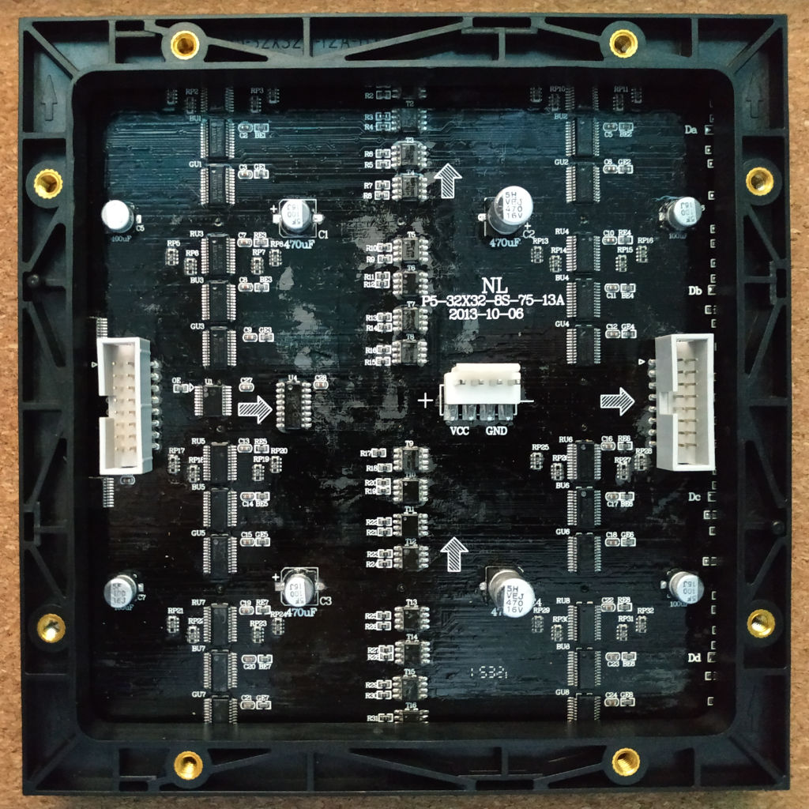
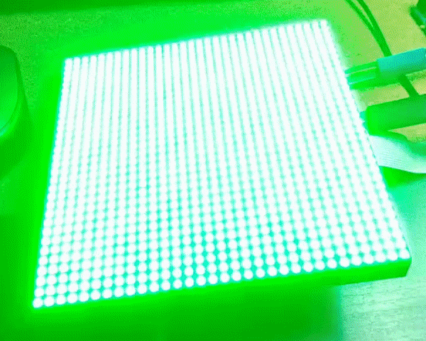
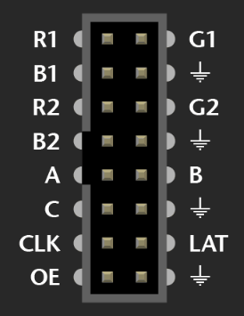

# P5-32X32-8S-75-13A

# Чипсет

- [MBI5124GP](https://lcsc.com/product-detail/LED-Drivers_MBI-MBI5124GP-B_C256866.html) Led driver
- [SM245TS](https://lcsc.com/product-detail/74-Series_Shenzhen-Sunmoon-Micro-SM245TS_C93846.html) Tri-state output signal Octal Transceiver
- [SM74HC138D](https://lcsc.com/product-detail/74-Series_Shenzhen-Sunmoon-Micro-SM74HC138_C91436.html) 3-to-8 demultiplexor

# Arduino library

Скорости плат ардуино определенно не хватает для отрисовки на подобных панелях, но тем не менее работает.

- [RGBmatrixPanelHalfScan](/RGBmatrixPanelHalfScan)

# Материалы

- [AdaFruits](https://learn.adafruit.com/32x16-32x32-rgb-led-matrix?view=all) Отличный гайд с описанием подключения
- https://www.youtube.com/watch?v=xyycbgZXPzE
- https://www.youtube.com/watch?v=nhCGgTd7OHg
- https://hackaday.io/project/26993-bot-matrix/log/69571-enter-the-matrix 
- http://wiki.amperka.ru/projects:rgb-led-matrix-arduino
- https://github.com/Frans-Willem/LEDMatrixHUB75 
